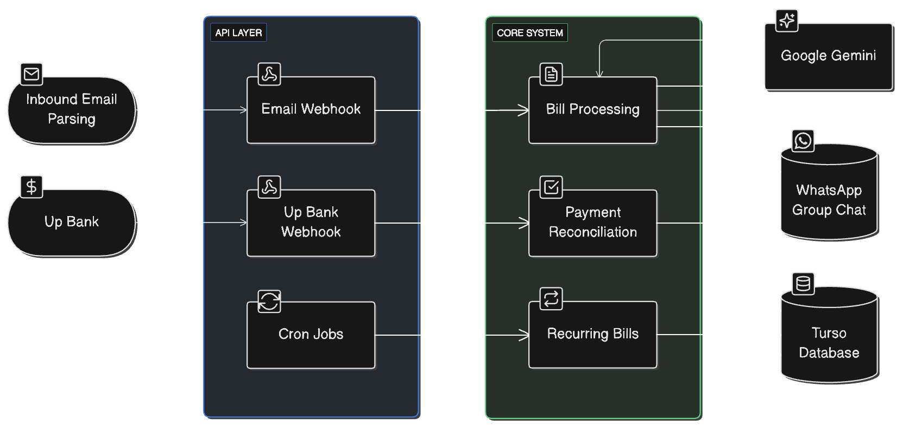

# Sharehouse Bills

A modern bill management system for shared housing, built with a simplified TanStack Start architecture. Automatically processes bill PDFs via email, splits costs among housemates, and tracks payments.

## 🏗️ Architecture



- **Frontend & Backend**: TanStack Start with React 19
- **Database**: Drizzle ORM with SQLite/Turso
- **Authentication**: Better Auth with session management
- **AI Processing**: Google Gemini 2.5 Flash for PDF parsing
- **Payment Integration**: Up Bank webhooks for automatic reconciliation
- **UI Components**: shadcn/ui with Tailwind CSS
- **Type Safety**: End-to-end TypeScript

## ✨ Features

### 📧 Email Bill Processing

- Forward emails to sendgrid to trigger the webhook
- AI automatically extracts bill details (amount, due date, biller)
- Creates bills and splits costs among active housemates
- Sends email notifications with processing results
- Posts in a WhatsApp group telling housemates about the new bill

### 🔄 Recurring Bills

- Automated weekly rent generation
- Customizable recurring bill templates
- Automatic splitting among active housemates
- Cron job integration for automation

### 👥 Housemate Management

- Add/edit/deactivate housemates
- Track individual debt history and payment statistics
- Assign custom amounts for specific bills
- View payment rates and outstanding balances

### 💰 Payment Tracking

- Mark individual debts as paid
- Bill status tracking (pending, partially paid, paid)
- Summary dashboard with payment statistics
- Individual housemate debt views

### 🚧 Planned Features

- **Up Bank Integration**: Automatic payment reconciliation via bank webhooks
- **Smart Payment Matching**: AI-powered transaction-to-debt matching

## 🚀 Getting Started

### Installation

1. **Clone and install dependencies:**

```bash
git clone https://github.com/jmcmullen/sharehouse-bills.git
cd sharehouse-bills
bun install
```

2. **Set up environment variables:**

```bash
cp .env.example .env
```

3. **Set up the database:**

```bash
bun db:push
```

4. **Start the development server:**

```bash
bun dev
```

Open [http://localhost:3001](http://localhost:3001) to view the application.

## 📁 Project Structure

```
sharehouse-bills/
├── src/
│   ├── api/                    # Database & server-side logic
│   │   ├── db/                 # Database schema & connection
│   │   │   └── schema/         # Drizzle schema files
│   │   ├── services/           # Business logic services
│   │   └── lib/                # Auth & utilities
│   ├── functions/              # TanStack Start server functions
│   │   ├── bills.ts            # Bill management functions
│   │   ├── housemates.ts       # Housemate management functions
│   │   └── todo.ts             # Test functionality
│   ├── routes/                 # File-based routing
│   │   ├── api.*.ts            # API route handlers
│   │   ├── bills.tsx           # Bills dashboard
│   │   ├── housemates.tsx      # Housemates management
│   │   └── login.tsx           # Authentication
│   ├── components/             # Reusable UI components
│   └── lib/                    # Client utilities
├── package.json                # Single package configuration
├── drizzle.config.ts          # Database configuration
└── vite.config.ts             # Build configuration
```

## 🛠️ Available Scripts

### Development

```bash
bun dev                   # Start development server (port 3001)
bun build                 # Build for production
bun typecheck             # Check TypeScript types
bun check                 # Run Biome formatting and linting
```

### Database

```bash
bun db:push               # Push schema changes to database
bun db:studio             # Open Drizzle Studio
bun db:generate           # Generate database migrations
bun db:migrate            # Run database migrations
```

## 🤝 Contributing

1. Fork the repository
2. Create a feature branch
3. Run `bun check` for linting
4. Run `bun typecheck` for type checking
5. Submit a pull request
