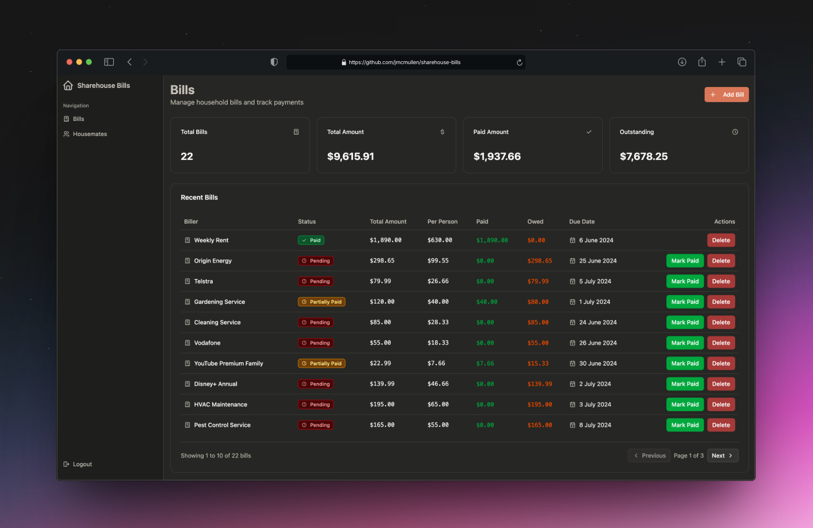

# Sharehouse Bills

A modern bill management system for shared housing, built with a simplified TanStack Start architecture. Automatically processes bill PDFs via email, splits costs among housemates, and tracks payments.

## 🏗️ Architecture

- **Frontend & Backend**: TanStack Start with React 19
- **Database**: Drizzle ORM with SQLite/Turso
- **Authentication**: Better Auth with session management
- **AI Processing**: Google Gemini 2.5 Flash for PDF parsing
- **Payment Integration**: Up Bank webhooks for automatic reconciliation
- **UI Components**: shadcn/ui with Tailwind CSS
- **Type Safety**: End-to-end TypeScript

## ✨ Features

### 📧 Email Bill Processing

- Receive or manually upload bill emails through Resend/webhook ingestion
- AI automatically extracts bill details (amount, due date, biller)
- Creates bills and splits costs among active housemates
- Sends email notifications with processing results
- Posts in a WhatsApp group telling housemates about the new bill

For local webhook testing with Cloudflare Tunnel, see [docs/local-webhooks.md](./docs/local-webhooks.md).

### 🔄 Recurring Bills

- Automated recurring bill generation for rent and other repeating charges
- Recurring bill management UI
- Customizable recurring bill templates
- Weekly, monthly, and yearly schedules
- Equal or custom split strategies
- Cron job integration for automation

## 🔄 Recurring Bills

Recurring bills are first-class templates in the app. They are used for rent
and any other repeating household charge that should generate bills on a
schedule.

### What a recurring bill template contains

Each template stores:

- template name
- biller name
- total amount
- frequency: weekly, monthly, or yearly
- schedule details such as day of week or day of month
- start date and optional end date
- active/paused state
- split strategy
- assigned housemates

### Split strategies

Recurring bills support two split modes:

- `equal`  
  the total amount is divided evenly across all included housemates in the
  template
- `custom`  
  each non-owner housemate can be assigned an explicit amount

For custom splits, owner share is treated as the remainder when applicable.

### Generation behavior

When a recurring bill becomes due:

- the system creates a new `bill` row
- debt rows are created for the relevant non-owner housemates
- the bill is linked back to the originating recurring bill template
- any existing housemate credit is automatically applied to the new debts

Duplicate generation is prevented for the same template and due date.

### Rent

Weekly rent is now managed through the recurring bill system rather than a
special separate flow. That means rent uses the same template, schedule,
assignment, preview, and generation logic as any other recurring bill.

### UI management

Recurring bills can be managed from the app UI:

- create a recurring bill template
- edit schedule and amount
- change included housemates
- switch between equal and custom splits
- pause or resume a template
- delete a template
- manually generate the next bill
- preview the next due date and expected split

### Automation

Recurring bills can be generated in two ways:

- manually from the UI using "Generate now"
- automatically from the cron endpoint

The cron flow only generates bills that are currently due and active.

### 👥 Housemate Management

- Add/edit/deactivate housemates
- Track individual debt history and payment statistics
- Assign custom amounts for specific bills
- View payment rates and outstanding balances

### 💰 Payment Tracking

- Mark individual debts as paid
- Bill status tracking (pending, partially paid, paid)
- Summary dashboard with payment statistics
- Individual housemate debt views
- Up Bank webhook reconciliation for incoming transfers
- Oldest-first allocation across unpaid debts for matching housemates
- Partial payment support and automatic credit carry-forward
- Opt-in payment parsing so non-bill transfers can be ignored safely

### 🚧 Planned Features

- **Smart Payment Matching**: AI-powered transaction-to-debt matching

## 💸 Up Bank Payment Reconciliation

Incoming Up Bank transfers are processed by the `/api/up-webhook` endpoint.
The webhook verifies Up's request signature, fetches the full transaction from
the Up API, and then decides whether the transfer should affect bill balances.

### Opt-in parsing

The system is intentionally opt-in.

A transfer is only treated as a bill payment if the note contains at least one
billing keyword:

- `rent`
- `bill`
- `bills`

If none of those words are present, the payment is ignored by the bill
reconciliation system and recorded as an ignored transfer.

Examples that are ignored:

- `iou`
- `dinner`
- `movie tickets`
- `jay`

This prevents normal transfers between housemates from being accidentally
applied to rent or bills.

### Case-insensitive matching

Payment note parsing is case-insensitive.

These are treated the same way:

- `rent jay`
- `Rent Jay`
- `RENT JAY`
- `Bills For Jay`

### Beneficiary-first matching

If a billing keyword is present, the parser tries to find the beneficiary:
the person whose debts should be paid.

Supported natural variants include:

- `rent jay`
- `bills jay`
- `for jay rent`
- `rent for jay`
- `jay bills`
- `paying jay rent`
- `jay's rent`
- `jay bill`

The parser uses normalized housemate names plus `bankAlias` values, and only
accepts a match when exactly one housemate is identified.

### Fallback matching

If the note contains a billing keyword but does not clearly name a beneficiary,
the system falls back to sender inference using the transaction text from Up:

- description
- message
- raw text

It tries to match a unique housemate by:

- alias
- full name
- first name

If that fallback is still ambiguous, the payment is left unreconciled for
manual review instead of being guessed.

### Allocation rules

Once a beneficiary is identified, the payment is applied to that housemate's
debts using these rules:

- the system first tries to match debts whose remaining amounts add up to the transfer amount
- if there is no exact amount match, it falls back to oldest unpaid debts first
- payments can be split across multiple debts automatically
- partial payments are supported
- debts track both `amountOwed` and `amountPaid`
- bill status updates automatically to `pending`, `partially_paid`, or `paid`

This means a single transfer can:

- fully pay one debt
- fully pay several debts
- partially pay the next debt if the amount runs out partway through

### Credit carry-forward

If a housemate pays more than they currently owe, the leftover amount is stored
as housemate credit.

That credit is then automatically applied to future debts for the same
housemate when new bills are created.

### Practical examples

- `iou`  
  ignored
- `rent jay`  
  applies to Jay's oldest debts
- `bills for jay`  
  applies to Jay's oldest debts
- `rent` from a uniquely identifiable housemate  
  applies to that housemate
- `rent sam alex`  
  unreconciled because the beneficiary is ambiguous
- `bills jay` with an amount larger than Jay's outstanding balance  
  pays Jay's debts and stores the remainder as credit

### Current limitation

The webhook currently reconciles on Up's `TRANSACTION_CREATED` event. That
means settlement/reversal handling is still a separate hardening step if you
want bank-state reconciliation to wait for final settlement.

## 🚀 Getting Started

### Installation

1. **Clone and install dependencies:**

```bash
git clone https://github.com/jmcmullen/sharehouse-bills.git
cd sharehouse-bills
bun install
```

2. **Set up environment variables:**

```bash
cp .env.example .env
```

3. **Set up the database:**

```bash
bun db:push
```

4. **Start the development server:**

```bash
bun dev
```

Open [http://localhost:3001](http://localhost:3001) to view the application.

## 📁 Project Structure

```
sharehouse-bills/
├── src/
│   ├── api/                    # Database & server-side logic
│   │   ├── db/                 # Database schema & connection
│   │   │   └── schema/         # Drizzle schema files
│   │   ├── services/           # Business logic services
│   │   └── lib/                # Auth & utilities
│   ├── functions/              # TanStack Start server functions
│   │   ├── bills.ts            # Bill management functions
│   │   ├── housemates.ts       # Housemate management functions
│   │   └── todo.ts             # Test functionality
│   ├── routes/                 # File-based routing
│   │   ├── api.*.ts            # API route handlers
│   │   ├── bills.tsx           # Bills dashboard
│   │   ├── housemates.tsx      # Housemates management
│   │   └── login.tsx           # Authentication
│   ├── components/             # Reusable UI components
│   └── lib/                    # Client utilities
├── package.json                # Single package configuration
├── drizzle.config.ts          # Database configuration
└── vite.config.ts             # Build configuration
```

## 🛠️ Available Scripts

### Development

```bash
bun dev                   # Start development server (port 3001)
bun build                 # Build for production
bun typecheck             # Check TypeScript types
bun check                 # Run Biome formatting and linting
```

### Database

```bash
bun db:push               # Push schema changes to database
bun db:studio             # Open Drizzle Studio
bun db:generate           # Generate database migrations
bun db:migrate            # Run database migrations
```

## 🤝 Contributing

1. Fork the repository
2. Create a feature branch
3. Run `bun check` for linting
4. Run `bun typecheck` for type checking
5. Submit a pull request
