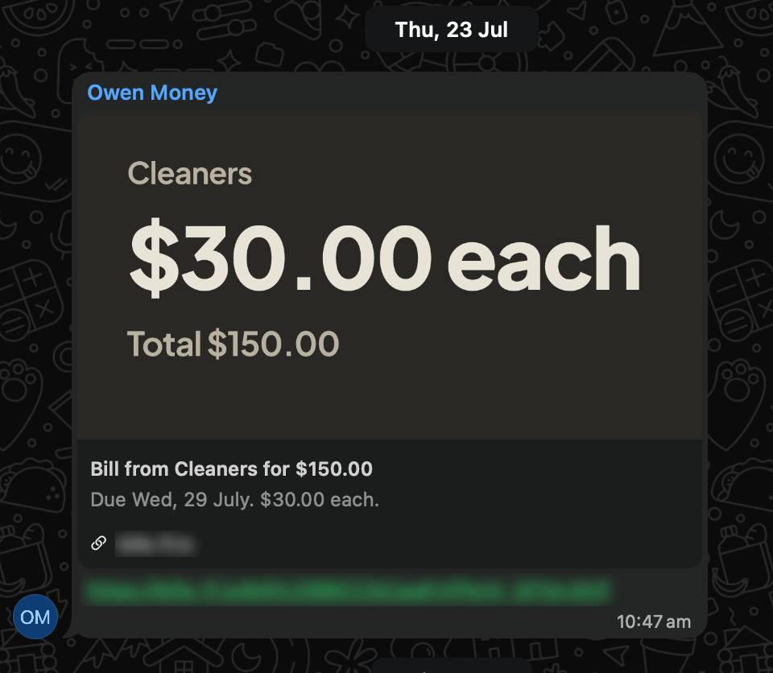
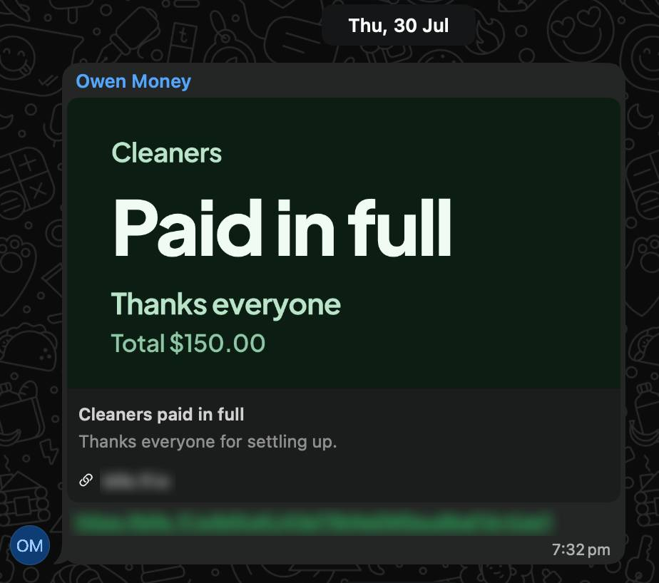

# Sharehouse Bills

Sharehouse Bills is a full-stack household billing app. It turns emailed,
uploaded, and recurring bills into per-housemate debts, reconciles matching Up
Bank transfers, and keeps the house updated through WhatsApp.

## WhatsApp integration

New and settled bills are shared as rich link previews, so the house can see the
important details without opening the app.

<table>
  <tr>
    <td width="50%">
      
    </td>
    <td width="50%">
      
    </td>
  </tr>
  <tr>
    <td align="center"><strong>New bill</strong></td>
    <td align="center"><strong>Paid in full</strong></td>
  </tr>
</table>

The WAHA-powered integration:

- posts a bill card to the configured group when a bill is created
- posts a settled card when a shared bill is paid in full
- sends private reminders, pay links, and payment receipts to housemates
- answers private natural-language questions about balances, bill breakdowns,
  overdue and upcoming bills, payment history, receipts, and pay links
- responds to group commands such as `due` while ignoring ordinary group chat
- generates custom Open Graph cards for bill, pay, and receipt links
- verifies inbound webhook HMACs and runs delivery through tracked, retryable
  workflows

Inbound WhatsApp events are handled at `POST /api/hooks/whatsapp`.

## Features

### Bill ingestion and management

- Receive PDF bills through a verified Resend inbound webhook at
  `POST /api/hooks/email`.
- Upload PDF bills manually from the dashboard.
- Extract known AGL, Hudson McHugh, and Neptune bill formats directly, with
  Vertex AI/Gemini as the general PDF fallback.
- Store source PDFs in Vercel Blob and avoid duplicate bill imports.
- Split bills across selected housemates using equal or custom amounts.
- Track pending, partially paid, and paid bills, including each housemate's
  outstanding balance and payment history.
- Manage housemates, bank aliases, WhatsApp numbers, credit balances, and active
  status.

### Recurring bills and reminders

- Create reusable weekly, fortnightly, monthly, or yearly bill templates.
- Use equal or custom splits and choose the participating housemates.
- Pause, resume, edit, delete, preview, or manually generate templates.
- Generate due templates automatically through the authenticated cron route.
- Configure individual or stacked WhatsApp reminders before and after a due
  date.
- Apply existing housemate credit automatically when a new debt is created.

The cron route, `GET /api/cron`, generates due recurring bills and queues due
reminders. It requires `CRON_SECRET` as a bearer token or `secret` query
parameter.

### Up Bank payment reconciliation

Incoming transfers are handled at `POST /api/hooks/up`. The route verifies Up's
request signature, fetches the complete transaction, and processes incoming
`TRANSACTION_CREATED` events.

Reconciliation is deliberately conservative:

- a transfer note must contain `rent`, `bill`, or `bills`
- the beneficiary is resolved from an explicit name or bank alias, then from
  sender details when there is one unambiguous match
- the amount must exactly match one open debt or an exact combination of open
  debts
- unmatched or ambiguous transfers are recorded as unreconciled instead of
  being guessed
- non-billing transfers are recorded as ignored
- successful matches update debts and bill status and can trigger WhatsApp
  receipt and paid-in-full notifications

The current webhook reacts to transaction creation. Settlement, reversal, and
deletion events are not yet applied to bill state.

### Public payment views

- Public bill pages show the total, per-person split, due date, and payment
  progress.
- Signed housemate pay links group outstanding bills and show what remains.
- Signed receipt links confirm a settled debt and link back to any remaining
  balance.
- Dedicated Open Graph image routes produce the WhatsApp cards shown above.

## Architecture

- **Application:** TanStack Start, React 19, Vite, and Nitro
- **UI:** Tailwind CSS 4, shadcn/ui, Radix UI, and Recharts
- **Database:** Drizzle ORM with SQLite/Turso
- **Authentication:** Better Auth
- **Bill extraction and assistant:** Google Vertex AI/Gemini
- **Email:** Resend inbound webhooks and result notifications
- **Payments:** Up Bank API and signed webhooks
- **WhatsApp:** WAHA plus durable workflow jobs
- **File storage:** Vercel Blob
- **Observability:** evlog structured request and workflow logging

## Getting started

### Prerequisites

- [Bun](https://bun.sh/) 1.2 or newer
- a Turso/libSQL database
- the provider credentials for whichever integrations you enable

### Installation

```bash
git clone https://github.com/jmcmullen/sharehouse-bills.git
cd sharehouse-bills
bun install
cp .env.example .env
```

Configure `.env` before starting the app. The main groups are:

| Capability | Environment variables |
| --- | --- |
| App and database | `VITE_BASE_URL`, `DATABASE_URL`, `DATABASE_AUTH_TOKEN`, `BETTER_AUTH_SECRET` |
| Bill PDFs and AI | `BLOB_READ_WRITE_TOKEN`, `GOOGLE_CLOUD_REGION`, `GOOGLE_VERTEX_PROJECT`, `GOOGLE_CLIENT_EMAIL`, `GOOGLE_PRIVATE_KEY` |
| Resend email | `RESEND_API_KEY`, `RESEND_WEBHOOK_SECRET`, `WEBHOOK_EMAIL_TO`, `WEBHOOK_EMAIL_FROM` |
| Up Bank | `UP_BANK_API_TOKEN`, `UP_BANK_WEBHOOK_SECRET`, `PAY_ID` |
| WhatsApp/WAHA | `WAHA_BASE_URL`, `WAHA_API_KEY`, `WAHA_SESSION_NAME`, `WAHA_WEBHOOK_SECRET`, `WHATSAPP_GROUP_CHAT_ID`, `WHATSAPP_ADMIN` |
| Public links and automation | `REMINDER_LINK_SECRET`, `CRON_SECRET`, `RECURRING_BILL_GENERATION_LEAD_DAYS` |

Push the schema and start the development server:

```bash
bun db:push
bun dev
```

The app runs at [http://localhost:4000](http://localhost:4000). For local Resend
webhook setup with Cloudflare Tunnel, see
[docs/local-webhooks.md](./docs/local-webhooks.md).

## Available scripts

| Command | Purpose |
| --- | --- |
| `bun dev` | Start Vite on port 4000 |
| `bun run build` | Create a production build |
| `bun serve` | Preview the production build |
| `bun typecheck` | Run TypeScript without emitting files |
| `bun check` | Run Biome formatting, linting, and import organization |
| `bun tunnel` | Run the configured Cloudflare tunnel |
| `bun db:push` | Push the current Drizzle schema |
| `bun db:generate` | Generate Drizzle migrations |
| `bun db:migrate` | Apply database migrations |
| `bun db:studio` | Open Drizzle Studio |
| `bun db:seed` | Seed local development data |
| `bun db:repair-recurring` | Repair recurring-bill generation dates |

## Project structure

```text
sharehouse-bills/
├── src/
│   ├── api/
│   │   ├── db/                 # Drizzle connection, schema, and migrations
│   │   └── services/           # Domain logic and external integrations
│   ├── components/             # Feature components and UI primitives
│   ├── functions/              # Authenticated TanStack server functions
│   ├── lib/                    # Shared application utilities
│   └── routes/                 # App pages, public views, and API handlers
├── workflows/                  # Retryable WhatsApp delivery workflows
├── docs/                       # Screenshots and local webhook notes
├── public/                     # Static assets
├── drizzle.config.ts
├── vite.config.ts
└── package.json
```

`src/routeTree.gen.ts` is generated by TanStack Router and should not be edited
manually.

## Contributing

Before opening a pull request, run:

```bash
bun check
bun typecheck
bun run build
```

Use concise Conventional Commit subjects such as `fix: handle duplicate bill`
or `feat: add payment receipt`.
